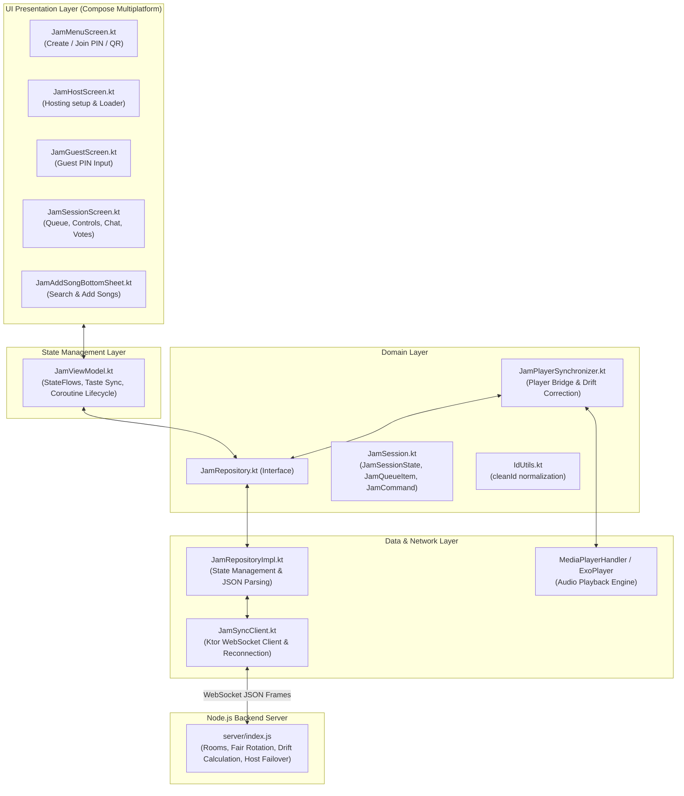

# Jam Room Architecture & Implementation Guide

This document provides a comprehensive technical overview of the **Jam Room** (Spotify Jam-style real-time collaborative listening) feature in **SimpMusic**. It covers system architecture, bidirectional WebSocket protocol, synchronization algorithms, file mapping across all layers, and crucial code snippets.

---

## 1. Feature Overview

The Jam Room feature enables multiple users to listen to synchronized music together in real-time.

### Key Capabilities:
- **Real-Time Playback Synchronization**: Sub-second synchronization between Host and Guests using server-timestamp drift correction and adaptive seek thresholds.
- **Collaborative Queue with Fair Rotation**: Multiple participants can add songs. The server uses a round-robin contributor rotation algorithm so no single user dominates the queue.
- **Democratic Upvoting / Prioritization**: Guests can vote on upcoming tracks, dynamically boosting their position in the queue.
- **Multi-User Taste Blending & Recommendations**: The app extracts each participant's top 20 listening history tracks and sends them to the server, which continuously interleaves personalized recommendations when the queue runs low.
- **Granular Host Permissions**: 7 distinct permission toggles (Add Songs, Remove Songs, Reorder, Pause, Skip, Seek, Voting).
- **Seamless Host Migration / Failover**: If the host disconnects or drops out, the server automatically promotes the longest-standing active guest to Host with UI notifications.
- **In-Session Live Chat**: Real-time messaging with unread badges.

---

## 2. High-Level Architecture & Flow



---

## 3. Connected Files Map

Below is the complete list of all files connected to the Jam Room feature:

| Layer | File Path | Primary Responsibility |
| :--- | :--- | :--- |
| **Backend** | [`server/index.js`](file:///c:/Programming%20Projects/personal%20projects/SimpMusic/server/index.js) | Node.js / `ws` WebSocket server; room management, fair queue rotation, voting logic, taste recommendation blending, and host transfer. |
| **Network Client** | [`core/service/jamSync/.../JamSyncClient.kt`](file:///c:/Programming%20Projects/personal%20projects/SimpMusic/core/service/jamSync/src/commonMain/kotlin/com/marki19/jamsync/JamSyncClient.kt) | Ktor WebSocket client managing the active socket connection, frame serialization, ping/pong heartbeat, and exponential backoff reconnection. |
| **Domain Models** | [`core/domain/.../JamSession.kt`](file:///c:/Programming%20Projects/personal%20projects/SimpMusic/core/domain/src/commonMain/kotlin/com/marki19/domain/jam/JamSession.kt) | Core data models: `JamSessionState`, `JamPlaybackState`, `JamQueueItem`, `JamParticipant`, `JamPermissions`, and sealed `JamCommand` definitions. |
| **Domain Interface** | [`core/domain/.../JamRepository.kt`](file:///c:/Programming%20Projects/personal%20projects/SimpMusic/core/domain/src/commonMain/kotlin/com/marki19/domain/jam/JamRepository.kt) | Contract for session lifecycle, command dispatching, incoming state flows, and chat messages. |
| **Player Sync** | [`core/domain/.../JamPlayerSynchronizer.kt`](file:///c:/Programming%20Projects/personal%20projects/SimpMusic/core/domain/src/commonMain/kotlin/com/marki19/domain/jam/JamPlayerSynchronizer.kt) | Bridges Jam room state with `MediaPlayerHandler` (ExoPlayer). Applies drift correction, enforces playback state, and prevents feedback loops. |
| **Utilities** | [`core/domain/.../IdUtils.kt`](file:///c:/Programming%20Projects/personal%20projects/SimpMusic/core/domain/src/commonMain/kotlin/com/marki19/domain/jam/IdUtils.kt) | Normalizes video IDs across YouTube URL variations (`cleanId()`). |
| **Data Impl** | [`core/data/.../JamRepositoryImpl.kt`](file:///c:/Programming%20Projects/personal%20projects/SimpMusic/core/data/src/commonMain/kotlin/com/marki19/data/repository/jam/JamRepositoryImpl.kt) | Implements `JamRepository`, parses JSON payloads into domain models, and manages coroutine scopes. |
| **DI Repository** | [`core/data/.../RepositoryModule.kt`](file:///c:/Programming%20Projects/personal%20projects/SimpMusic/core/data/src/commonMain/kotlin/com/maxrave/data/di/RepositoryModule.kt) | Koin DI declarations for `JamSyncClient`, `JamRepository`, and `JamPlayerSynchronizer`. |
| **ViewModel** | [`composeApp/.../JamViewModel.kt`](file:///c:/Programming%20Projects/personal%20projects/SimpMusic/composeApp/src/commonMain/kotlin/com/marki19/simpmusic/viewModel/jam/JamViewModel.kt) | UI ViewModel orchestrating session creation, joining, queue mutations, chat state, taste sync, and event emissions. |
| **DI ViewModel** | [`composeApp/.../ViewModelModule.kt`](file:///c:/Programming%20Projects/personal%20projects/SimpMusic/composeApp/src/commonMain/kotlin/com/maxrave/simpmusic/di/ViewModelModule.kt) | Koin DI module registering `JamViewModel` as a singleton. |
| **Navigation** | [`composeApp/.../JamDestination.kt`](file:///c:/Programming%20Projects/personal%20projects/SimpMusic/composeApp/src/commonMain/kotlin/com/marki19/simpmusic/ui/navigation/destination/jam/JamDestination.kt) | Type-safe navigation routes (`JamMenuDestination`, `JamHostDestination`, `JamGuestDestination`, `JamSessionDestination`). |
| **Nav Graph** | [`composeApp/.../JamScreenGraph.kt`](file:///c:/Programming%20Projects/personal%20projects/SimpMusic/composeApp/src/commonMain/kotlin/com/marki19/simpmusic/ui/navigation/graph/JamScreenGraph.kt) | Compose NavGraph registering Jam screens. |
| **UI Menu** | [`composeApp/.../JamMenuScreen.kt`](file:///c:/Programming%20Projects/personal%20projects/SimpMusic/composeApp/src/commonMain/kotlin/com/marki19/simpmusic/ui/screen/jam/JamMenuScreen.kt) | Entry hub: Start a Jam, Join with 6-character PIN, QR code scan, and recent rooms. |
| **UI Host** | [`composeApp/.../JamHostScreen.kt`](file:///c:/Programming%20Projects/personal%20projects/SimpMusic/composeApp/src/commonMain/kotlin/com/marki19/simpmusic/ui/screen/jam/JamHostScreen.kt) | Hosting initialization screen with loader and cancellation handling. |
| **UI Guest** | [`composeApp/.../JamGuestScreen.kt`](file:///c:/Programming%20Projects/personal%20projects/SimpMusic/composeApp/src/commonMain/kotlin/com/marki19/simpmusic/ui/screen/jam/JamGuestScreen.kt) | Guest PIN entry pad, QR scanner trigger, and join state handler. |
| **UI Session** | [`composeApp/.../JamSessionScreen.kt`](file:///c:/Programming%20Projects/personal%20projects/SimpMusic/composeApp/src/commonMain/kotlin/com/marki19/simpmusic/ui/screen/jam/JamSessionScreen.kt) | Main active Jam session: reorderable queue, voting buttons, playback controls, participant avatars, settings sheet, and chat drawer. |
| **UI Add Song** | [`composeApp/.../JamAddSongBottomSheet.kt`](file:///c:/Programming%20Projects/personal%20projects/SimpMusic/composeApp/src/commonMain/kotlin/com/marki19/simpmusic/ui/screen/jam/JamAddSongBottomSheet.kt) | Search & add songs modal to search YouTube Music and inject into the shared queue. |

---

## 4. Key Mechanisms & How They Work

### 4.1 Playback Synchronization & Drift Correction
To keep the host and all guests in sync without stuttering:
1. **Server Timestamping**: Whenever playback state updates, the server attaches `serverTimestampMs = Date.now()`.
2. **Drift Calculation on Client**:
   $$\text{lagMs} = \max(0, \text{nowMs} - \text{serverTimestampMs})$$
   $$\text{targetPositionMs} = \text{playbackPositionMs} + (\text{if isPlaying then } \text{lagMs} \text{ else } 0)$$
3. **Threshold Check**: If $|\text{currentPositionMs} - \text{targetPositionMs}| > 3000\text{ ms}$, the guest performs an explicit `seekTo(targetPositionMs)`. Small variations ($< 3\text{ s}$) are allowed to play through smoothly without constant seeking.

### 4.2 Host vs. Guest Sync Roles
- **Host**:
  - The Host's local `MediaPlayerHandler` is the **authoritative source**.
  - Local events (track finished, seek, play/pause) are dispatched to `jamRepository.syncState()`.
  - The Host ignores echoed server playback state updates to avoid recursive feedback loops.
- **Guest**:
  - The Guest's player strictly listens to `sessionState` from the server and mirrors the track, play/pause state, and progress.
- **`syncMutex`**: All player modifications in `JamPlayerSynchronizer` are wrapped in a Kotlin coroutine `Mutex` to prevent concurrent race conditions between user clicks and incoming network packets.

### 4.3 Fair Contributor Queue Insertion
When multiple participants add songs, `server/index.js` computes the insertion index using contributor round-robin rotation:
```javascript
function fairInsertPosition(queue, addedBy) {
    if (queue.length === 0) return 0;
    const manualQueue = queue.filter(item => !item.isRecommendation);
    const counts = {};
    for (const item of manualQueue) counts[item.addedBy] = (counts[item.addedBy] || 0) + 1;
    const myCount = counts[addedBy] || 0;
    
    // Position after contributors who have fewer/equal songs, before those with more
    let insertAt = manualQueue.length;
    // ... maps manual index to full queue index
    return insertAt;
}
```

### 4.4 Voting & Dynamic Queue Reordering
- Each track in `JamPlaybackState.queue` has a `voteCount` and `voterIds: Set<String>`.
- When a user taps upvote, `JamCommand.Vote(queueId)` is sent.
- The server increments the vote count and calculates an `orderWeight`:
  $$\text{orderWeight} = \text{voteCount} \times 1000 - \text{addedTimestamp}$$
- Unplayed tracks with higher vote counts float ahead of lower-voted tracks while preserving contributor fairness within the same vote tier.

### 4.5 Multi-User Taste Blending
- Upon joining or hosting, `JamViewModel.syncTaste()` queries the local Room database for the user's top 20 most played / liked songs.
- These are sent via `JamCommand.ShareTaste(tracks)` to the server.
- When the manual queue has $\le 2$ tracks left, the server interleaves recommendations sampled from all active participants' taste profiles.

### 4.6 Automatic Host Failover
- If the host connection drops, a 15-second grace timer is initiated.
- If the host does not reconnect, the server selects the earliest-joined active guest and promotes them to Host:
  ```javascript
  session.hostId = nextHostId;
  broadcast(roomId, {
      type: "HOST_TRANSFER",
      newHostId: nextHostId,
      newHostName: nextHostUser.name,
      message: `${nextHostUser.name} is now the host of the Jam.`
  });
  ```

---

## 5. Crucial Code References

### 5.1 Domain Data Models & Commands ([`JamSession.kt`](file:///c:/Programming%20Projects/personal%20projects/SimpMusic/core/domain/src/commonMain/kotlin/com/marki19/domain/jam/JamSession.kt#L10-L147))

```kotlin
@Serializable
data class JamQueueItem(
    val queueId: String,
    val videoId: String,
    val title: String = "",
    val artist: String = "",
    val thumbnailUrl: String? = null,
    val durationMs: Long = 0L,
    val addedBy: String = "",
    val addedTimestamp: Long = 0L,
    val voteCount: Int = 0,
    val voterIds: Set<String> = emptySet(),
    val orderWeight: Double = 0.0,
    val isPlaying: Boolean = false,
    val isRecommendation: Boolean = false,
)

data class JamSessionState(
    val roomId: String,
    val isHost: Boolean,
    val hostId: String,
    val participants: List<JamParticipant> = emptyList(),
    val permissions: JamPermissions = JamPermissions(),
    val playbackState: JamPlaybackState = JamPlaybackState(),
    val guestTastes: Map<String, List<String>> = emptyMap(),
    val isSyncing: Boolean = false,
    val newHostNotice: String? = null,
    val recommendationsEnabled: Boolean = false,
)

sealed class JamCommand {
    object Play : JamCommand()
    object Pause : JamCommand()
    data class Seek(val positionMs: Long) : JamCommand()
    data class Skip(val direction: Int = 1) : JamCommand()
    data class AddToQueue(val videoId: String, val title: String, val artist: String, val thumbnailUrl: String?, val durationMs: Long) : JamCommand()
    data class RemoveQueueItem(val queueId: String, val videoId: String = "") : JamCommand()
    data class MoveQueueItem(val queueId: String, val toIndex: Int) : JamCommand()
    data class PlayNow(val videoId: String, val title: String, val artist: String, val thumbnailUrl: String?, val durationMs: Long) : JamCommand()
    data class Vote(val queueId: String) : JamCommand()
    data class SetShuffle(val enabled: Boolean) : JamCommand()
    data class SetRepeat(val mode: JamRepeatMode) : JamCommand()
    data class ShareTaste(val tracks: List<TasteTrack>) : JamCommand()
    data class ChatMessage(val senderId: String, val text: String, val timestamp: Long) : JamCommand()
}
```

---

### 5.2 Player Synchronizer Engine ([`JamPlayerSynchronizer.kt`](file:///c:/Programming%20Projects/personal%20projects/SimpMusic/core/domain/src/commonMain/kotlin/com/marki19/domain/jam/JamPlayerSynchronizer.kt#L107-L255))

```kotlin
// Guest synchronization logic:
private suspend fun syncGuestPlayer(state: JamSessionState) {
    syncMutex.withLock {
        val pb = state.playbackState
        val targetVideoId = pb.currentSongId?.cleanId() ?: return
        val currentVideoId = mediaPlayerHandler.nowPlayingState.value.track?.videoId?.cleanId()

        // 1. If song changed, load the new media item
        if (currentVideoId != targetVideoId) {
            val queueItem = pb.queue.find { it.videoId.cleanId() == targetVideoId }
            val track = getOrCreateTrack(
                videoId = targetVideoId,
                title = queueItem?.title ?: "",
                artist = queueItem?.artist ?: "",
                thumbnailUrl = queueItem?.thumbnailUrl,
                durationMs = queueItem?.durationMs ?: 0L
            )
            mediaPlayerHandler.addMediaItem(track.toGenericMediaItem(), playWhenReady = pb.isPlaying)
            lastSyncedSongId = targetVideoId
        }

        // 2. Compute drift and sync progress
        val lagMs = if (pb.serverTimestampMs > 0)
            (Clock.System.now().toEpochMilliseconds() - pb.serverTimestampMs).coerceAtLeast(0L)
        else 0L
        val targetPos = if (pb.isPlaying) pb.playbackPositionMs + lagMs else pb.playbackPositionMs
        val currentPos = mediaPlayerHandler.getProgress()

        if (kotlin.math.abs(currentPos - targetPos) > DRIFT_THRESHOLD_MS) {
            mediaPlayerHandler.onPlayerEvent(PlayerEvent.SeekTo(targetPos))
        }

        // 3. Sync Play / Pause state
        val isLocallyPlaying = mediaPlayerHandler.controlState.value.isPlaying
        if (pb.isPlaying != isLocallyPlaying) {
            mediaPlayerHandler.onPlayerEvent(if (pb.isPlaying) PlayerEvent.Play else PlayerEvent.Pause)
        }
    }
}
```

---

### 5.3 WebSocket Communication Client ([`JamSyncClient.kt`](file:///c:/Programming%20Projects/personal%20projects/SimpMusic/core/service/jamSync/src/commonMain/kotlin/com/marki19/jamsync/JamSyncClient.kt#L63-L125))

```kotlin
class JamSyncClient(private val serverUrl: String) {
    private val wsClient = HttpClient(getEngine()) {
        install(WebSockets) { pingIntervalMillis = 20_000L }
    }
    private val _messages = MutableSharedFlow<JamMessage>(extraBufferCapacity = 32)
    val messages = _messages.asSharedFlow()
    private val outbound = Channel<String>(Channel.BUFFERED)

    suspend fun connect(getRoomId: () -> String?, userId: String, name: String, imageUrl: String) {
        disconnect()
        // Connects with exponential back-off and spawns concurrent read & write coroutines
        val activeSession = withTimeout(15_000L) { wsClient.webSocketSession(serverUrl) }
        session = activeSession
        
        // Outbound queue writer
        launch {
            for (msg in outbound) {
                activeSession.send(Frame.Text(msg))
            }
        }
        // Inbound message reader
        launch {
            for (frame in activeSession.incoming) {
                if (frame is Frame.Text) {
                    val parsed = json.decodeFromString<JamMessage>(frame.readText())
                    _messages.emit(parsed)
                }
            }
        }
    }

    suspend fun sendCommand(command: String, payload: JsonObject? = null) {
        val msg = JamMessage(type = "COMMAND", command = command, payload = payload)
        outbound.send(json.encodeToString(msg))
    }
}
```

---

### 5.4 ViewModel Session Creation ([`JamViewModel.kt`](file:///c:/Programming%20Projects/personal%20projects/SimpMusic/composeApp/src/commonMain/kotlin/com/marki19/simpmusic/viewModel/jam/JamViewModel.kt#L210-L290))

```kotlin
fun createSession(
    initialVideoId: String? = null,
    initialTitle: String? = null,
    initialArtist: String? = null,
    initialThumbnailUrl: String? = null,
    initialDurationMs: Long? = null
) {
    sessionInitJob?.cancel()
    sessionInitJob = viewModelScope.launch(Dispatchers.IO) {
        if (jamRepository.sessionState.value != null) {
            jamRepository.leaveSession()
        }
        _isConnecting.value = true
        try {
            withTimeout(5.minutes) {
                val account = accountRepository.getUsedGoogleAccount().firstOrNull()
                val dsName = dataStoreManager.getString("AccountName").firstOrNull()
                val dsThumb = dataStoreManager.getString("AccountThumbUrl").firstOrNull()

                val userId = account?.email?.takeIf { it.isNotBlank() } ?: "User-${(1000..9999).random()}"
                val name = dsName?.takeIf { it.isNotBlank() } ?: account?.name?.takeIf { it.isNotBlank() } ?: "Host"
                val rawImg = dsThumb?.takeIf { it.isNotBlank() } ?: account?.thumbnailUrl ?: ""
                val imageUrl = if (rawImg.startsWith("//")) "https:$rawImg" else rawImg

                _localUserId = userId
                jamRepository.createSession(userId, name, imageUrl)
                syncTaste()

                // If a track was playing when hosting, queue and start it in the Jam
                val effectiveVideoId = initialVideoId?.ifBlank { null }
                    ?: mediaPlayerHandler.nowPlayingState.value.track?.videoId
                if (effectiveVideoId != null) {
                    sendCommand(JamCommand.AddToQueue(
                        videoId = effectiveVideoId,
                        title = initialTitle ?: "",
                        artist = initialArtist ?: "",
                        thumbnailUrl = initialThumbnailUrl,
                        durationMs = initialDurationMs ?: 0L
                    ))
                }
            }
        } catch (e: Exception) {
            _isConnecting.value = false
            _connectionError.emit("Failed to create Jam: ${e.message}")
        }
    }
}
```

---

## 6. Concurrency & Thread Safety Rules

1. **No `runBlocking` on Main Thread**:
   - All network and DataStore operations must run on `Dispatchers.IO`.
   - Never call `.first()` inside a synchronous property getter or Composable invocation.
2. **ExoPlayer Dispatching**:
   - `MediaPlayerHandler` and `ExoPlayer` APIs (`play`, `pause`, `seekTo`, `addMediaItem`) must execute on the Main thread (`Dispatchers.Main`).
3. **`syncMutex` Protection**:
   - Every state change inside `JamPlayerSynchronizer` is locked with `syncMutex` to prevent concurrent interleaving of incoming WebSocket packets and UI events.
4. **ID Normalization**:
   - Always invoke `.cleanId()` on video IDs before equality comparisons or map indexing to prevent duplicate queue items caused by query parameters (e.g. `?si=...` or full URLs).

---

## 7. Summary & Verification Checklist

- [x] Node.js WebSocket Server configured with automatic room cleanup and failover.
- [x] Multiplatform Ktor Client handles automatic reconnection with exponential backoff.
- [x] `JamPlayerSynchronizer` handles Host authoritative sync and Guest drift correction.
- [x] Fair rotation queue interleaves contributor tracks fairly.
- [x] Upvoting dynamically ranks queue tracks.
- [x] Real-time chat with unread indicator badges.
- [x] 7 granular permission toggles enforced at the server and UI layers.
